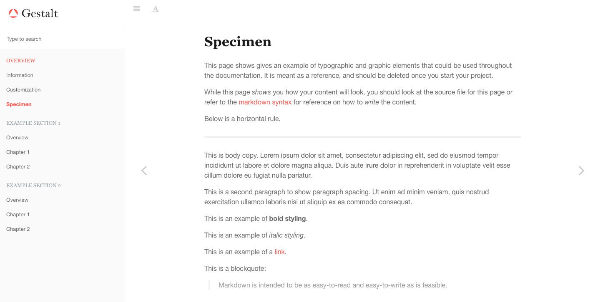

# Gestalt Theme for Gitbook

Gestalt is a theme for [Gitbook](http://www.gitbook.com). While its layout is based off of the [default Gitbook theme](https://github.com/GitbookIO/theme-default), it aims to be highly configurable for styling.

This theme is for you if the default theme is well enough, but you need more control in how it looks.



## Usage

This theme works with Gitbook version `>= 3.0.0`. To include it in your project, edit your `book.json` to include the theme as a plugin.

```
"plugins": [ "theme-gestalt" ]
```

A recommended usage would be the following:

```
"plugins": [ "theme-gestalt", "-theme-default", "styles-sass-fix" ]
```

This configuration adds the Gestalt theme, removes the default theme, and includes the `styles-sass-fix` plugin to allow you to write your own SCSS to extend the styling. See [Style Customization](#style-customization) for more info.

### Config Options

Below are the theme options available for Gestalt. 

```
"pluginsConfig": {
	"theme-gestalt": {
	    "logo": "/assets/logo.png",				// path to the logo file to use in the sidebar
	    "favicon": "/assets/favicon.png",		// path to your favicon
	    "excludeDefaultStyles": true			// excludes the pre-compiled theme css in favor of your custom css
	}
}
```

## Style Customization

TODO:
